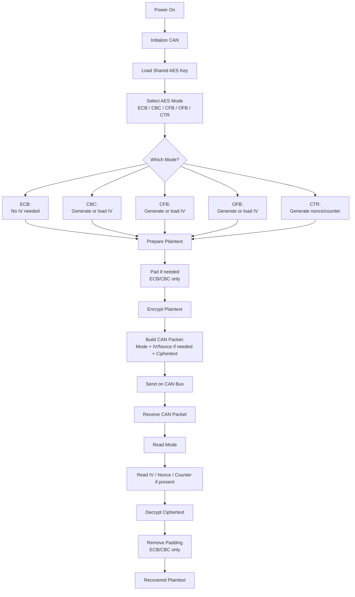

# Encryption-and-Cryptography-with-ARM

# Cryptography on ARM (STM32F446RE)

This repository contains C implementations of classical and modern cryptographic algorithms, built and tested on the STM32F446RE Nucleo board. It includes a small custom cryptography library, example programs, and a PDF that documents the approach, implementations, and outputs captured from hardware runs.

## Contents

### Algorithms Implemented
- Monoalphabetic cipher  
- Polyalphabetic cipher (Vigenère‑style approach)  
- AES (key schedule, encryption, and implemented modes)

### Library
- Minimal C library for the above algorithms  
- Reusable headers and source files  

### Targets
- STM32F446RE (ARM Cortex‑M4)  
- Example projects for on‑device testing  

### Documentation
- PDF with explanations, code walkthroughs, and output logs/screenshots from the MCU  

## Project Goals
- Translate cryptographic concepts into working embedded implementations.  
- Validate algorithms on real hardware using deterministic test vectors and observed outputs.  
- Provide a clean baseline for future work on public‑key cryptography and secure random generation methods for embedded systems.

